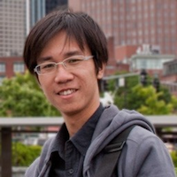
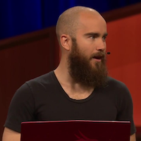

# 第四章：物体检测

在2012年之前，物体检测一直是计算机视觉加上机器学习的天下。当时主要的研究方向是如何设计高质量的特征提取器和高效的分类器和回归器。当时特征提取器比较有代表性的算法有HoG，SIFT等，而分类任务几乎是SVM的天下。

早期的物体检测基本上也遵循四步走的流程：

1. Selective Search选取候选区域；
2. 特征提取器提取特征；
3. 分类器和回归器预测类别和位置四要素；
4. non maximum suppression合并检测框。

2012年，Hinton团队的AlexNet  在ILSVRC大赛中将精度提高了约10个百分点。从此，计算机视觉的各个方向都开始考虑使用深度学习解决他们的问题。

卷积网络作为特征提取器首先引起了业内研究者的注意，2014年，使用深度学习解决物体检测问题的开山之作R-CNN 应运而生，论文的一作Ross B. Girshick（RBG）不仅是该方向的鼻祖，而且其一系列的论文也引领了物体检测的发展方向。R-CNN的目的也很单纯，只是将特征提取器简单的换成了CNN。

## Ross B. Girshick

**骨干网络**：同时在2014年，网络模型方向诞生了两个非常经典的网络结构，一是牛津大学计算机视觉组的VGG ，另外一个是谷歌公司的GoogLeNet  。VGG使用了当时最流行的深度学习框架Caffe，并非常有先见之明的开源了其训练好的网络模型。VGG也作为骨干网络成为了之后3-4年的检测算法的主要使用骨干网络，代表算法便是RBG的R-CNN系列的三篇文章。随着数据量的增大和人们对高精度的追求，骨干网络更深的深度成为了一个最容易想到的方向。很幸运，2016年深度学习领域的另外一尊大神，我国广东省2003年的高考理科状元何恺明的残差网络使用short-cut解决了深度学习中的退化问题，因为其无限深度的能力成为了近几年物体检测算法骨干网络主要使用的算法，经典算法包括R-FCN，Mask R-CNN以及YOLOv3等。

## 何恺明

**端到端模型**：物体检测的一个非常重要的优化方向是优化传统方法四步走的流程，2015年RBG的Fast R-CNN 使用softmax替代了SVM，进而将特征提取和分类模型的训练合二为一，算是第一个端到端的物体检测算法。在R-FCN 中使用了更为快速的投票机制替代了Fast R-CNN中的softmax，因为softmax前往往要接最少一层全连接，这也成了制约Fast R-CNN速度的一个重要瓶颈。YOLOv3  则是使用$$C$$路sigmoid的多标签模型增强了对覆盖样本的检测能力。

同是在2015年，RBG和何恺明强强联手，推出了使用RPN替代了Selective Search的Faster R-CNN  算法。Faster R-CNN因为其最高的算法精度和在显卡环境下的近实时的速度性能，也成了今年最为流行的算法之一。Faster R-CNN因其巧妙的设计也是深度学习面试官最爱问的算法之一。

Faster R-CNN系列虽然在实现上实现了端到端训练，但是其两步走（候选区域提取+位置精校）的策略也被一些人诟病。2016年，Joseph Redmon提出了更为革命性的 YOLO 系列算法。不同于R-CNN系列分两步走的策略，YOLO是单次检测检测的算法，YOLO可以看做是高精度的RPN。其更彻底的端到端训练将物体检测的速度大幅提升，在非顶端显卡环境下也实现了实时检测。

## Joseph Redmon

**降采样池化**：无论是Selective Search还是RPN，得到的候选区域在尺寸和比例上都是不固定的，由此输入到网络中得到的Feature Map大小是不同的，最后展开成的特征向量长度也不固定，在目前的开源框架下，暂不支持变长的特征向量作为输入。在SPP  中，作者提出了金字塔池化的方式，通过多尺度分bin的形式得到长度固定的特征向量，在Fast R-CNN中将其简化为单尺度并命名为ROI Pooling。Mask R-CNN 发现当ROI Pooling应用到语义分割任务中会存在若干个像素的偏移误差，由此设计了更为精确的ROIAlign。

**锚点**：Faster R-CNN最大的特点是在RPN网络中引入了锚点机制，对锚点一个更好的解释是先验框，即对检测框的先验假设。在早期阶段，锚点是根据开发者的经验手动写死的。在YOLOv2 中，作者在训练集对锚点进行了k-means聚类，进而产生了一组更优代表性的锚点。DSSD中锚点的设置则是根据聚类的结果分析得到的。

**小尺寸物体检测困难**：在所有的检测算法中都普遍存在着小尺寸物体检测困哪的问题。究其原因，是因为在深层网络中随着语义信息的增强，位置信息也越来越弱，这是深度网络的固有问题。SSD  率先提出使用各个阶段的Feature Map都参与损失函数的计算，在FPN  中则是通过将各个阶段的Feature Map融合到一起的方式，融合的方式有FPN中从小尺寸向大尺寸融合的双线性插值上采样算法，也是目前最为广泛使用的融合方法；DSSD  则是通过反卷积得到不仅将小尺寸Feature Map上采样，而且包含语义信息的Feature Map；而YOLOv2采用的是中的大尺寸向小尺寸融合的`space_to_depth()`算法。而YOLOv3则是接合了FPN和锚点机制的思想，为不同深度的Feature Map赋予了不同比例，不同尺寸的锚点。

YOLOv2中采用的另外一个解决方案则是在训练过程中，不同批使用不同尺寸的输入图像。

**半监督学习**：系列算法中一个非常有商业前景的方向便是通过半监督学习的方式增加模型可处理的类别。半监督学习即是通过少量的带标签数据和大量的无标签数据，将模型的能力扩展到无标签数据中。YOLO9000  通过WordTree融合了80类的检测数据集COCO和9418类的分类数据集ImageNet，生成了可以检测9418类物体的模型。$$\mathbf{Mask}^X$$ **R-CNN** 则是通过权值迁移函数融合了80类的分割数据COCO和3000类的检测数据集Visual Gnome，生成了可以分割3000类物体的模型。

**物体检测和语义分割**：近几年物体检测和语义分割的距离越来越小，双方都在汲取对方的算法来获得灵感和优化算法。最典型的算法便是Mask R-CNN中融合了分类，检测和分割的三任务模型。DSSD使用反卷积进行上采样也非常有意思

最后预测一下未来一段时间物体检测的发展方向：

1. 小尺寸物体检测困难至今尚未有效解决，更有效的多尺度Feature Map，或者针对小尺寸物体的特定算法是研究的一个热点和难点；
2. 半监督学习：能否将语义分割任务扩展到ImageNet类别中，提升非子类或父类物体的无监督学习能力是一大热点；
3. 嵌入式平台的物体检测算法：目前最快的YOLOv3的实时运行依然依赖GPU环境，能否将检测算法实时的应用到嵌入式平台，例如手机，扫地机器人，无人机等都是有急切需求的场景；
4. 特定领域的物体检测算法：目前在单一领域发展较靠前的是场景文字检测算法。但在一些特定的场景中，例如医学，安检，微生物等依然很有研究前景，也是比较容易有研究成果和应用场景的方向。

如果您是一个有一定物体检测研究基础的读者，我从各个方向帮您梳理了近年来物体检测的发展历程。如果您对上面所说的算法不知所云，不要着急，我会在后面的章节中详细的解析上面提到过的所有算法。了解完本章的所有内容之后，再来重读这一部分，你一定会构建更清晰的知识体系。

读到这，你可能觉得有些枯燥和乏味。我在《复仇者联盟3》的预告片中运行了一下YOLOv3物体检测算法，也许能提高提高你继续读下去的兴趣，视频见百度云：[https://pan.baidu.com/s/1rv7QhuUAWleW5XjeEka8kQ](https://pan.baidu.com/s/1rv7QhuUAWleW5XjeEka8kQ)。

