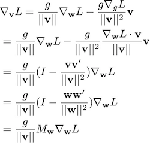

# Weight Normalization

tags：Normalization

## 前言

之前介绍的[BN](https://senliuy.gitbooks.io/advanced-deep-learning/content/di-ba-zhang-ff1a-wang-luo-you-hua/batch-normalization.html)\[2\]和[LN](https://senliuy.gitbooks.io/advanced-deep-learning/content/di-ba-zhang-ff1a-wang-luo-you-hua/layer-normalization.html)\[3\]都是在数据的层面上做的归一化，而这篇文章介绍的Weight Normalization（WN\)是在权值的维度上做的归一化。WN的做法是将权值向量$$\mathbf{w}$$在其欧氏范数和其方向上解耦成了参数向量$$\mathbf{v}$$和参数标量$$g$$后使用SGD分别优化这两个参数。

WN也是和样本量无关的，所以可以应用在batchsize较小以及RNN等动态网络中；另外BN使用的基于mini-batch的归一化统计量代替全局统计量，相当于在梯度计算中引入了噪声。而WN则没有这个问题，所以在生成模型，强化学习等噪声敏感的环境中WN的效果也要优于BN。

WN没有一如额外参数，这样更节约显存。同时WN的计算效率也要优于要计算归一化统计量的BN。

## 1. WN详解

### 1.1 WN的计算

神经网络的一个节点计算可以表示为：

$$
y = \phi(\mathbf{w}\cdot\mathbf{x}+b)
$$

其中$$\mathbf{w}$$是一个$$k$$-维的特征向量，$$y$$是该神经节点的输出，所以是一个标量。在得到损失值后，我们会根据损失函数的值使用SGD等优化策略更新$$\mathbf{w}$$和$$b$$。WN提出的归一化策略是将$$\mathbf{w}$$分解为一个参数向量$$\mathbf{v}$$和一个参数标量$$g$$，分解方法为

$$
\mathbf{w} = \frac{g}{||\mathbf{v}||} \mathbf{v}
$$

上式中$$||\mathbf{v}||$$表示$$\mathbf{v}$$的欧氏范数。当$$\mathbf{v}=\mathbf{w}$$且$$g = ||\mathbf{w}||$$时，WN还原为普通的计算方法，所以WN的网络容量是要大于普通神经网络的。

 图1：权值向量的分解可视化

当我们将$$g$$固定为$$||\mathbf{w}||$$时，我们只优化$$\mathbf{v}$$，这时候相当于只优化$$\mathbf{w}$$的方向而保留其范数。当$$\mathbf{v}$$固定为$$\mathbf{w}$$时，这时候相当于只优化$$\mathbf{w}$$的范数，而保留其方向，这样为我们优化权值提供了更多可以选择的空间，且解耦方向与范数的策略也能加速其收敛。

在优化$$g$$时，我们一般通过优化$$g$$的log级参数$$s$$来完成，即$$g = e^s$$。

$$\mathbf{v}$$和$$g$$的更新值可以通过SGD计算得到：

$$
\nabla_g L = \frac{\nabla_{\mathbf w}L \cdot \mathbf{v}}{||\mathbf{v}||}
\qquad
\nabla_{\mathbf{v}} L = \frac{g}{||\mathbf{v}||} \nabla_{\mathbf{w}} L - \frac{g\nabla_g L}{||\mathbf{v}||^2} \mathbf{v}
$$

其中$$L$$为损失函数，$$\nabla_{\mathbf{w}}L$$为$$\mathbf{w}$$在$$L$$下的梯度值。

从上面WN的计算公式中我们可以看出WN并没有引入新的参数，

### 1.2 WN的原理

1.1节的梯度更新公式也可以写作：

$$
\nabla_{\mathbf{v}} L = \frac{g}{||\mathbf{v}||} M_{\mathbf{w}} \nabla_{\mathbf w}L
\quad
\text{with}
\quad
M_{\mathbf{w}} = I - \frac{\mathbf{w}\mathbf{w}'}{||\mathbf{w}||^2}
$$

推导方式如下：

倒数第二步的推导是因为$$\mathbf{v}$$是$$\mathbf{w}$$的方向向量。上面公式反应了WN两个重要特征：

1. $$\frac{g}{||\mathbf{v}||}$$表明WN会对权值梯度进行$$\frac{g}{||\mathbf{v}||}$$的缩放；
2. $$M_{\mathbf{w}} \nabla_{\mathbf w}L$$表明WN会将梯度投影到一个远离于$$\nabla_{\mathbf w}L$$的方向。

这两个特征都会加速模型的收敛。

具体原因论文的说法比较复杂，其核心思想有两点：1.由于$$\mathbf{w}$$垂直于$$M_{\mathbf{w}}$$，所以$$\nabla_{\mathbf{v}}L$$非常接近于垂直参数方向$$\mathbf{w}$$，这样对于矫正梯度更新方向是非常有效的；2.$$\mathbf{v}$$和梯度更新值中的噪声量成正比，而$$\mathbf{v}$$是和更新量成反比，所以当更新值中噪音较多时，更新值会变小，这说明WN有自稳定（self-stablize）的作用。这个特点使得我们可以在WN中使用比较大的学习率。

另一个角度从新权值的协方差矩阵出发的，假设$$\mathbf{w}$$的协方差矩阵是$$\mathbf{C}$$，那么$$\mathbf{v}$$的协方差矩阵$$\mathbf{D} = (g^2/||\mathbf{v}||^2)M_{\mathbf{w}}\mathbf{C}M_{\mathbf{w}}$$，当去掉$$\mathbf{D}$$中的特征值后我们发现新的$$\mathbf{D}$$非常趋近于一个单位矩阵，这说明了$$\mathbf{w}$$是$$\mathbf{C}$$的主特征向量（dominant eigenvector），说明WN有助于提升收敛速度。

### 1.3 BN和WN的关系

假设$$t = \mathbf{v} \mathbf{x}$$，$$\mu[t]$$和$$\sigma[t]$$分别为$$t$$的均值和方差，BN可以表示为：

$$
t' = \frac{t-\mu[t]}{\sigma[t]} = \frac{\mathbf{v}}{\sigma[t]}\mathbf{x} - \frac{\mu[t]}{\sigma[t]}
$$

当网络只有一层且输入样本服从均值为0，方差为1的独立分布时，我们有$$\mu[t]=0$$且$$\sigma[t] = ||\mathbf{v}||$$，此时WN和BN等价。

### 1.4 WN的参数初始化

由于WN不像BN有规范化特征尺度的作用，所以WN的初始化需要慎重。作者建议的初始化策略是：

* $$\mathbf{v}$$使用均值为0，标准差为0.05的正态分布进行初始化；
* $$g$$和偏置$$b$$使用第一批训练样本的统计量进行初始化：

$$
g \leftarrow \frac{1}{\sigma[t]}
\qquad
b \leftarrow \frac{-\mu[t]}{\sigma[t]}
$$

由于使用了样本进行初始化，所以这种初始化方法不适用于RNN等动态网络。

### 1.5 Mean-Only BN

基于WN的动机，文章提出了Mean-Only BN。这种方法是一个只进行减均值而不进行除方差的BN，动机是考虑到BN的除方差操作会引入额外的噪声，实验结果表明WN+Mean-Only BN虽然比标准BN收敛得慢，但它们在测试集的精度要高于BN。

## 2. 总结

和目前主流归一化方法不同的是，WN的归一化操作作用在了权值矩阵之上。从其计算方法上来看，WN完全不像是一个归一化方法，更像是基于矩阵分解的一种优化策略，它带来了四点好处：

1. 更快的收敛速度；
2. 更强的学习率鲁棒性；
3. 可以应用在RNN等动态网络中；
4. 对噪声更不敏感，更适用在GAN，RL等场景中。

说WN不像归一化的原因是它并没有对得到的特征范围进行约束的功能，所以WN依旧对参数的初始值非常敏感，这也是WN一个比较严重的问题。

