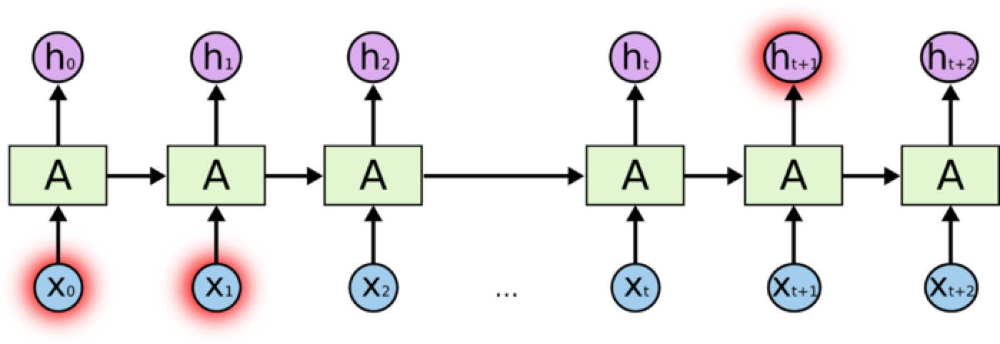
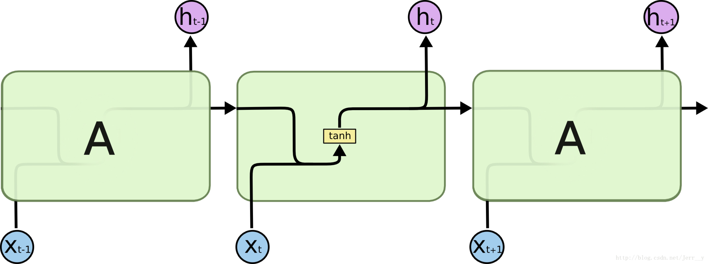
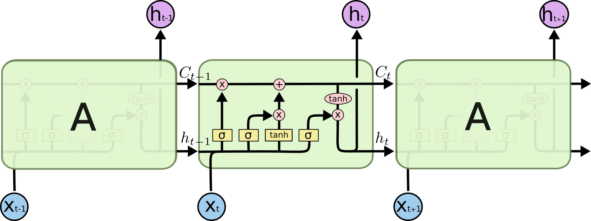

# About Long Short Term Memory

## 1. 背景

### Recurrent Neural Networks \(RNN\)

在使用深度学习处理时序问题时，RNN是最常使用的模型之一。RNN之所以在时序数据上有着优异的表现是因为RNN在$$t$$时间片时会将$$t-1$$时间片的隐节点作为当前时间片的输出，也就是RNN具有图1的结构。这样有效的原因是之前时间片的信息也用于计算当前时间片的内容，而传统模型的隐节点的输出只取决于当前时间片的输入特征。

#### 图1：RNN的链式结构


RNN的数学表达式可以表示为

$$
h_t = \sigma(x_t*w_{xt} + h_{t-1} * w_{ht} + b)
$$

而传统的DNN的隐节点表示为

$$
h_t = \sigma(x_t*w_{xt} + b)
$$

对比RNN和DNN的隐节点的计算方式，我们发现唯一不同之处在于RNN将上个时间片的隐节点状态$$h_{t-1}$$也作为了神经网络单元的输入，这也是RNN删除处理时序数据最重要的原因。

所以，RNN的隐节点$$h_{t-1}$$有两个作用

1. 计算在该时刻的预测值$$\hat{y}_t$$
2. 计算下个时间片的隐节点状态$$h_t$$

RNN的该特性也使RNN在很多学术和工业前景，例如OCR，语音识别，股票预测等领域上有了十足的进展。

### 长期依赖\(Long Term Dependencies\)

在深度学习领域中（尤其是RNN），“长期依赖“问题是普遍存在的。长期依赖产生的原因是当神经网络的节点经过许多阶段的计算后，之前比较长的时间片的特征已经被覆盖，例如下面例子

```text
eg1: The cat, which already ate a bunch of food, was full.
      |   |     |      |     |  |   |   |   |     |   |
     t0  t1    t2      t3    t4 t5  t6  t7  t8    t9 t10
eg2: The cats, which already ate a bunch of food, were full.
      |   |      |      |     |  |   |   |   |     |    |
     t0  t1     t2     t3    t4 t5  t6  t7  t8    t9   t10
```

我们想预测'full'之前系动词的单复数情况，显然full是取决于第二个单词’cat‘的单复数情况，而非其前面的单词food。根据图1展示的RNN的结构，随着数据时间片的增加，RNN丧失了学习连接如此远的信息的能力（图2）。

#### 图2：RNN的长期依赖问题

### 梯度消失/爆炸

梯度消失和梯度爆炸是困扰RNN模型训练的关键原因之一，产生梯度消失和梯度爆炸是由于RNN的权值矩阵循环相乘导致的，相同函数的多次组合会导致极端的非线性行为。梯度消失和梯度爆炸主要存在RNN中，因为RNN中每个时间片使用相同的权值矩阵。对于一个DNN，虽然也涉及多个矩阵的相乘，但是通过精心设计权值的比例可以避免梯度消失和梯度爆炸的问题。

处理梯度爆炸可以采用梯度截断的方法。所谓梯度截断是指将梯度值超过阈值$$\theta$$的梯度手动降到$$\theta$$。虽然梯度截断会一定程度上改变梯度的方向，但梯度截断的方向依旧是朝向损失函数减小的方向。

对比梯度爆炸，梯度消失不能简单的通过类似梯度截断的阈值式方法来解决，因为长期依赖的现象也会产生很小的梯度。在上面例子中，我们希望t9时刻能够读到t1时刻的特征，在这期间内我们自然不希望隐层节点状态发生很大的变化，所以\[t2, t8\]时刻的梯度要尽可能的小才能保证梯度变化小。很明显，如果我们刻意提高小梯度的值将会使模型失去捕捉长期依赖的能力。

## 2. LSTM

LSTM的全称是Long Short Term Memory，顾名思义，它具有记忆长短期信息的能力的神经网络。LSTM首先在1997年由Hochreiter & Schmidhuber  提出，由于深度学习在2012年的兴起，LSTM又经过了若干代大牛的发展，由此便形成了比较系统且完整的LSTM框架，并且在很多领域得到了广泛的应用。本文着重介绍深度学习时代的LSTM。

LSTM提出的动机是为了解决上面我们提到的长期依赖问题。传统的RNN节点输出仅由权值，偏置以及激活函数决定（图3）。RNN是一个链式结构，每个时间片使用的是相同的参数。

#### 图3：RNN单元



而LSTM之所以能够解决RNN的长期依赖问题，是因为LSTM引入了门（gate）机制用于控制特征的流通和损失。对于上面的例子，LSTM可以做到在t9时刻将t2时刻的特征传过来，这样就可以非常有效的判断t9时刻使用单数还是负数了。LSTM是由一系列LSTM单元（LSTM Unit）组成，其链式结构如下图。

#### 图4：LSTM单元



在后面的章节中我们再对LSTM的详细结构进行讲解，首先我们先弄明白LSTM单元中的每个符号的含义。每个黄色方框表示一个神经网络层，由权值，偏置以及激活函数组成；每个粉色圆圈表示元素级别操作；箭头表示向量流向；相交的箭头表示向量的拼接；分叉的箭头表示向量的复制。总结如图5.

#### 图5：LSTM的符号含义

LSTM的核心部分是在图4中最上边类似于传送带的部分（图6），这一部分一般叫做单元状态（cell state）它自始至终存在于LSTM的整个链式系统中。

#### 图6：LSTM的单元状态

其中

$$
C_t = f_t * C_{t-1} + i_t * \tilde{C}_t
$$

其中$$f_t$$叫做遗忘门，表示$$C_{t-1}$$的哪些特征被用于计算$$C_t$$。 $$f_t$$是一个向量，向量的每个元素均位于$$[0,1]$$范围内，向量的维度 ）。通常我们使用Sigmoid作为激活函数，sigmoid的输出是一个介于$$[0, 1]$$区间内的值，但是当你观察一个训练好的LSTM时，你会发现门的值绝大多数都非常接近0或者1，其余的值少之又少。其中$$\otimes$$是LSTM最重要的门机制，表示$$f_t$$和$$C_{t-1}$$之间的单位乘的关系。

#### 图7：LSTM的遗忘门

如图8所示，$$\tilde{C}_t$$表示单元状态更新值，由输入数据$$x_t$$和隐节点$$h_{t-1}$$经由一个神经网络层得到，单元状态更新值的激活函数通常使用tanh。$$i_t$$叫做输入门，同$$f_t$$一样也是一个元素介于$$[0, 1]$$区间内的向量，同样由$$x_t$$和$$h_{t-1}$$经由Sigmoid激活函数计算而成。

#### 图8：LSTM的输入门和单元状态更新值的计算方式

$$i_t$$用于控制$$\tilde{C}_t$$的哪些特征用于更新$$C_t$$，使用方式和$$f_t$$相同（图9）。

#### 图9：LSTM的输入门的使用方法

最后，为了计算预测值$$\hat{y}_t$$和生成下个时间片完整的输入，我们需要计算隐节点的输出$$h_t$$（图10）。

#### 图10：LSTM的输出门


$$h_t$$由输出门$$o_t$$和单元状态$$C_t$$得到，其中$$o_t$$的计算方式和$$f_t$$以及$$i_t$$相同。在的论文中指出，通过将$$b_o$$的均值初始化为1，可以使LSTM达到同GRU近似的效果。

## 3. 其他LSTM

联想之前介绍的GRU ，LSTM的隐层节点的门的数量和工作方式貌似是非常灵活的，那么是否存在一个最好的结构模型或者比LSTM和GRU性能更好的模型呢？Rafal 等人采集了能采集到的100个最好模型，然后在这100个模型的基础上通过变异的形式产生了10000个新的模型。然后通过在字符串，结构化文档，语言模型，音频4个场景的实验比较了这10000多个模型，得出的重要结论总结如下：

1. GRU，LSTM是表现最好的模型；
2. GRU的在除了语言模型的场景中表现均超过LSTM；
3. LSTM的输出门的偏置的均值初始化为1时，LSTM的性能接近GRU；
4. 在LSTM中，门的重要性排序是遗忘门 &gt; 输入门 &gt; 输出门。

