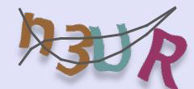
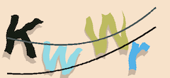

# 实例解析：字符验证码破解

## 实例解析：字符验证码破解

### 前言

如果MNIST数据集是计算机视觉届的“Hello, World”的话，那么破解字符验证码就是计算机视觉届的99乘法表。目前市场上的字符验证码一般是由大小写英文字母和阿拉伯数字组成，最常见的是4个字符，下面我们来一步步解析如何使用前面介绍的知识一步步破解字符验证码，尝试了近10个不同得网站，平均精度能够控制到99%上下。在文章中出于法律问题的原因，并不会列举破解了哪些公司的验证码。

### 1. 综述

破解一个网站的验证码主要分成以下步骤：

1. 数据爬取和标注；
2. 模型搭建和数据预处理；
3. 合成数据和迁移学习；
4. n折交叉数据清洗；
5. 模型fine-tune。

以上的算法的开发环境我使用的是python 2.7.6 + keras 2.1.2 \(TensorFlow做后端\)，若使用截止最新的版本 python 3.7.0及keras 2.2.0，代码需要进行语法的微调后便可运行。

#### 1.1 数据爬取和标注

破解一个网站的验证码，标注数据样本是必不可少的一步。为了减轻标注数据的成本，我一般标注11500张数据，其中10000张作为训练集，1000张作为测试集，500张作为验证集。标注数据可以采用亚马逊等平台提供的众包工具，当然不怕浪费时间的话也可以自己标。注意外包出去的验证码由于各种各样的原因导致存在标注错误的情况，一般用户常犯两种错误：

1. 近似字符的标注错误，例如‘U’和‘V’等，我一般叫这种错误为**眼花错误**；
2. 键盘临近字符敲错，例如‘S’和‘D’等，我一般叫做**手抖错误**。

清理训练集错误数据是将模型能力提升至接近100%的至关重要的一步，我们在1.4节介绍如何使用模型帮助我们清理训练集数据。但是对于验证集我建议还是自己手动清理，原因有三点：1. 测试集加验证集数据并不多，一般两三个小时便可手动清理完毕；2. 清理的过程中，我们顺便观察验证码的样式，为下一步迁移学习积累知识；3. 1.4节使用的n折数据交叉清洗的方法并不能保证100%清理干净。

#### 1.2 模型搭建

我一般使用CNN+GRU+CTC损失的网络结构，这也是OCR场景中最流行的框架结构，其中我在第一章进行了CNN的介绍，GRU和CTC在第二章进行了介绍，算法详解参考具体章节的内容。

**1.2.1 CNN**

一般验证码的场景比较简单，使用简单的VGG模式便可以解决。即

$$m\times(n\times(conv\_33)+max\_pooling)$$

其中n是根据验证码的复杂程度决定，一般复杂程度表示的是验证码的干扰因素的多少，我们在1.3节会手动合成样本，验证码的复杂度你会在进行这一过程时深刻的感受到。一般n为2-4之间。

m的大小取决于验证码最短边的长度，我们在第一章介绍过，每次pooling便进行一次降采样，此时Feature Map的大小会减半。在输入RNN之前，对于验证码这种简单的场景，最后一层的Feature Map的尺寸在5-10之间是一个优先选择的尺寸。目前市场上的主流验证码的最短边（高度）一般在30-100之间，所以m优先取值2到5。

**1.2.2 GRU和CTC**

在经过CNN得到Feature Map之后，我们需要将Feature Map展开成一个向量，然后经过一个全连接的编码之后作为GRU的输入。全连接我一般使用的节点数目为32。

关于GRU这一部分介绍的并不多，在目前的所有网站中，我使用的均是两层双向GRU结构，其中隐节点数量为128。

**1.2.3 分类函数**

在GRU之后接的是使用softmax激活函数的全连接层。由于只有10000张训练数据，所以为了减轻过拟合，推荐添加Dropout，一般丢失率我设置为0.25。

为了提高精度，softmax一般不使用全部62个字母和数字字符，而是由训练集的标注数据统计得到。一般验证码字符的分布属于均匀分布，对于10000张训练集，一个字符平均出现1000-2000次，此时要注意那些出现概率很低的字符，极有可能是标注错误的样本。用户在标注样本时，可能犯的错误很多，推荐在统计字符时使用try...except...捕捉异常情况。

**1.2.4 CTC**

最后使用CTC构造损失函数。要非常注意的一点是Keras封装的decode函数存在内存泄漏的问题，长时间训练或者测试时会产生内存不足的问题。这里我根据单独重现了CTC的Beam Search函数，读者可以网上自行搜索相关源码。

**代码片段1：网络模型keras实现**

```python
#hypter parameters
m = 2
n = 2
rnn_size = 128

input_tensor = Input((width, height, 3))
x = input_tensor
for i in range(m):
    for j in range(n):
        x = Convolution2D(32, (3, 3), activation='relu')(x)
    x = MaxPooling2D(pool_size=(2, 2))(x)

conv_shape = x.get_shape()
x = Reshape(target_shape=(int(conv_shape[1]), int(conv_shape[2] * conv_shape[3])))(x)
x = Dense(32, activation='relu')(x)

gru_1 = GRU(rnn_size, return_sequences=True, kernel_initializer='he_normal', name='gru1')(x)
gru_1b = GRU(rnn_size, return_sequences=True, go_backwards=True, kernel_initializer='he_normal', name='gru1_b')(x)
gru1_merged = add([gru_1, gru_1b])
gru_2 = GRU(rnn_size, return_sequences=True, kernel_initializer='he_normal', name='gru2')(gru1_merged)
gru_2b = GRU(rnn_size, return_sequences=True, go_backwards=True, kernel_initializer='he_normal', name='gru2_b')(
    gru1_merged)
x = concatenate([gru_2, gru_2b])
x = Dropout(0.25)(x)
x = Dense(n_class, kernel_initializer='he_normal', activation='softmax')(x)
base_model = Model(input=input_tensor, output=x)

labels = Input(name='the_labels', shape=[n_len], dtype='float32')
input_length = Input(name='input_length', shape=[1], dtype='int64')
label_length = Input(name='label_length', shape=[1], dtype='int64')
loss_out = Lambda(ctc_lambda_func, output_shape=(1,), name='ctc')([x, labels, input_length, label_length])

model = Model(input=[input_tensor, labels, input_length, label_length], output=[loss_out])
```

#### 1.3 合成数据和迁移学习

当训练样本不足时，先使用迁移学习进行模型初始化再使用标注数据进行微调是目前最主流的算法。而迁移学习的样本推荐手动合成和标注样本尽可能像的数据，这样有点有三：

1. 和标注样本相似的合成样本能达到比较好的初始化效果，甚至合成样本的精度有可能超过90%；
2. 当任务比较复杂时，推荐每次训练样本均是重新合成的，这样由于每个训练样本均不相同，减轻了过拟合的问题。
3. 验证码的样式比较简单，合成算法并不会非常复杂。

常见的验证码随机样式包括，

1. 文字的随机，一般包括随机字符，随机大小，随机字体，随机颜色，随机位置，随机旋转角度，文字扭曲；
2. 背景的随机，一般使用随机颜色，随机背景图片；
3. 噪音干扰，一般有噪点干扰和干扰线；

合成数据一般由反向预处理和正向合成效果组成。

**1.3.1 反向预处理**

常见的预处理操作有

1. 二值化减少字符和背景颜色的干扰；
2. 滤波器过滤噪音；
3. 边缘增强加强文字和背景的对比度。

此处验证集便发挥非常重要的作用了，因为我们在训练和测试数据中也会采用相同的预处理方案，所以我们必须确保预处理在500张验证数据上均起到了正向的作用，否则此预处理操作便不能直接使用。

**图1：某网站验证码和预处理效果图**

**1.3.2 正向合成**

此处为代码量最大的一部分，即自己制作和训练样本尽可能相似的样本，常用的python包有OpenCV和Pillow，一般的变化通过随机数便可以解决，在我接触的验证码中，有两类变化比较难模拟——扭曲的文字和光滑的干扰线。对于扭曲的文字，我们可以使用对文字区域施加波形变化得到，对于光滑曲线，这类曲线叫做贝泽尔曲线，关于波形变化和贝泽尔曲线我会在附录A中给出代码片段。

**图2：某网站验证码及合成的验证码**

 

**1.3.3 迁移学习**

对于使用合成数据进行迁移学习来说，一般有两种方案：

1. 边合成边学习：这种方法的优点是每次的训练样本都不一样，学习的模型更不容易过拟合。问题是由于合成使用的是CPU，这一阶段往往成为性能瓶颈而不能充分发挥GPU的作用，从而导致收敛时间过长。
2. 先合成数据再学习：这种方法的优点是模型迭代的快，一般是方案1的几十倍。缺点是合成数据需要占用硬盘空间，尤其是硬盘节点数，而且有过拟合的潜在问题。

对于上面两种方案，我推荐方案2。因为在使用合成数据进行迁移学习之后，我们要继续使用标注数据进行微调，所以迁移学习的初始化并不是决定模型的关键，一定程度的误差是可以允许的。一般在任务2中，我会合成50万到100万张数据，然后loss收敛到小数点后两位即可。或者在睡觉时将服务挂着，第二天初始化的模型便可以用了。

#### 1.4 n折交叉数据清洗

迁移学习之后便可以进行模型微调了，此时一般可以得到一个95%-97%准确率的模型，此时向上提升精度便变得非常困难。因此为了得到更高的精度，清洗训练数据便成了不可避免的一步。这里，我根据n折交叉验证的思想，设计了使用训练集清理自身数据的方法，所以该方法便叫做n折交叉数据清洗。

所谓n折交叉数据清洗，即将训练集随机分成个子集$$S$$。分别使用第$$i$$个子集$$s_i \in S$$作为测试集，其它子集共同作为训练集。在迁移学习得到的模型的基础上独立训练n个模型，$$M = \{m_1, m_2, ..., m_n\}$$。然后使用$$m_i$$测试$$s_i$$，这时绝大多数的错误样本便会被检测出来，尤其是由于“手抖错误”导致的错误样本。最后根据模型的测试效果用户手动检查并清洗错误样本即可。

这样做的原因是用户标注错误$$p_1$$和模型识别错误$$p_2$$可近似看做两个相互独立的事件，那么一个样本同时被标注错误和识别错误的概率为$$p_1\times p_2$$，期望错误样本数便是$$10000\times p_1\times p_2$$。假设$$p_1\approx 0.05$$，$$p2\approx 0.05$$，即有$$p1\times p2\approx 0.0025$$，那么此时10000张训练集中的错误样本的期望便只有25张了。

为了进一步确保训练集的准确率，可以再使用一次n折交叉数据清洗，不过一般我只使用一次。

### 1.5 模型fine-tune

得到清洗后的训练数据后，便可以使用这些数据进行模型微调了，由于训练样本比较少而且比较干净，一般几个小时就收敛了。中间可以隔一段时间就保存一个模型，由于10000个训练样本非常容易导致过拟合，所以我们通过验证集选择一个早停版本的模型。

## 附录A

**代码片段2：波形变换**

```python
def gene_wave(img, row, col):
    channel = 3
    img = img_as_float(img)
    img_out = img * 1.0
    alpha = 70.0
    beta = 30.0
    degree = 3.0

    center_x = (col - 1) / 2.0
    center_y = (row - 1) / 2.0

    xx = np.arange(col)
    yy = np.arange(row)

    x_mask = numpy.matlib.repmat(xx, row, 1)
    y_mask = numpy.matlib.repmat(yy, col, 1)
    y_mask = np.transpose(y_mask)

    xx_dif = x_mask - center_x
    yy_dif = center_y - y_mask

    x = degree * np.sin(2 * math.pi * yy_dif / alpha) + xx_dif
    y = degree * np.cos(2 * math.pi * xx_dif / beta) + yy_dif

    x_new = x + center_x
    y_new = center_y - y

    int_x = np.floor(x_new)
    int_x = int_x.astype(int)
    int_y = np.floor(y_new)
    int_y = int_y.astype(int)

    for ii in range(row):
        for jj in range(col):
            new_xx = int_x[ii, jj]
            new_yy = int_y[ii, jj]

            if x_new[ii, jj] < 0 or x_new[ii, jj] > col - 1:
                continue
            if y_new[ii, jj] < 0 or y_new[ii, jj] > row - 1:
                continue

            img_out[ii, jj, :] = img[new_yy, new_xx, :]

    img_out = Image.fromarray(np.uint8((img_out) * 255))
    return img_out
```

代码片段3：贝泽尔曲线

```python
# bazier 曲线
def make_bezier(xys):
    # xys should be a sequence of 2-tuples (Bezier control points)
    n = len(xys)
    combinations = pascal_row(n - 1)

    def bezier(ts):
        # This uses the generalized formula for bezier curves
        # http://en.wikipedia.org/wiki/B%C3%A9zier_curve#Generalization
        result = []
        for t in ts:
            tpowers = (t ** i for i in range(n))
            upowers = reversed([(1 - t) ** i for i in range(n)])
            coefs = [c * a * b for c, a, b in zip(combinations, tpowers, upowers)]
            result.append(
                tuple(sum([coef * p for coef, p in zip(coefs, ps)]) for ps in zip(*xys)))
        return result

    return bezier


def pascal_row(n):
    # This returns the nth row of Pascal's Triangle
    result = [1]
    x, numerator = 1, n
    for denominator in range(1, n // 2 + 1):
        # print(numerator,denominator,x)
        x *= numerator
        x /= denominator
        result.append(x)
        numerator -= 1
    if n & 1 == 0:
        # n is even
        result.extend(reversed(result[:-1]))
    else:
        result.extend(reversed(result))
    return result


# 用来绘制干扰线
def gene_line(image):
    (width, height) = size
    rand = random.random()
    if rand < 0.5:
        line_color = (80, 90, 90)
    else:
        line_color = (0, 0, 12)
    xys = []
    for i in range(0, 4):
        xys.append((20 + i * 140, random.randint(0, height)))
    ts = [t / 100.0 for t in range(101)]
    bezier = make_bezier(xys)
    points = bezier(ts)
    draw = ImageDraw.Draw(image)  # 创建画笔
    draw.line(points, fill=line_color, width=5)
    return image
```

