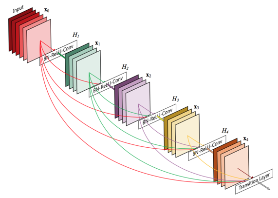

# Densely Connected Convolutional Networks

## 前言

在残差网络的文章中，我们知道残差网格,能够应用在特别深的网络中的一个重要原因是，无论正向计算精度还是反向计算梯度，信息都能毫无损失的从一层传到另一层。如果我们的目的是保证信息毫无阻碍的传播，那么残差网络的stacking残差块的设计便不是信息流通最合适的结构。

基于信息流通的原理，一个最简单的思想便是在网络中的每个卷积操作中，将其低层的所有特征作为该网络的输入，也就是在一个层数为L的网络中加入$$\frac{L(L+1)}{2}$$个short-cut, 如图1。为了更好的保存低层网络的特征，DenseNet 使用的是将不同层的输出拼接在一起，而在残差网络中使用的是单位加操作。以上便是DenseNet算法的动机。

#### 图1：DenseNet中一个Dense Block的设计



## 1. DenseNet算法解析及源码实现

在DenseNet中，如果全部采用图1的结构的话，第L层的输入是之前所有的Feature Map拼接到一起。考虑到现今内存/显存空间的问题，该方法显然是无法应用到网络比较深的模型中的，故而DenseNet采用了图2所示的堆积Dense Block的形式，下面我们针对图2详细解析DenseNet算法。

#### 图2：DenseNet网络结构


### 1.1 Dense Block

图1便是一个Dense Block，在Dense Block中，第$$l$$层的输入$$x_l$$是这个块中前面所有层的输出:

$$x_l = [y_0, y_1, ..., y_{l-1}]$$

$$y_l = H_l(x_l)$$

其中，中括号$$[y_0, y_1, ..., y_{l-1}]$$表示拼接操作，即按照Feature Map将$$l-1$$个输入拼接成一个Tensor。$$H_l(\cdot)$$表示合成函数（Composite function）。在实现时，我使用了stored\_features存储每个合成函数的输出。

```python
def dense_block(x, depth=5, growth_rate = 3):
    nb_input_feature_map = x.shape[3].value
    stored_features = x
    for i in range(depth):
        feature = composite_function(stored_features, growth_rate = growth_rate)
        stored_features = concatenate([stored_features, feature], axis=3)
    return stored_features
```

### 1.2 合成函数（Composite function）

合成函数位于Dense Block的每一个节点中，其输入是拼接在一起的Feature Map, 输出则是这些特征经过`BN->ReLU->3*3`卷积的三步得到的结果，其中卷积的Feature Map的数量是成长率（Growth Rate）。在DenseNet中，成长率k一般是个比较小的整数，在论文中，$$k=12$$。但是拼接在一起的Feature Map的数量一般比较大，为了提高网络的计算性能，DenseNet先使用了$$1\times1$$卷积将输入数据降维到$$4k$$，再使用$$3\times3$$卷积提取特征，作者将这一过程标准化为`BN->ReLU->1*1卷积->BN->ReLU->3*3卷积`，这种结构定义为DenseNetB。

```python
 def composite_function(x, growth_rate):
    if DenseNetB: #Add 1*1 convolution when using DenseNet B
        x = BatchNormalization()(x)
        x = Activation('relu')(x)
        x = Conv2D(kernel_size=(1,1), strides=1, filters = 4 * growth_rate, padding='same')(x)
    x = BatchNormalization()(x)
    x = Activation('relu')(x)
    output = Conv2D(kernel_size=(3,3), strides=1, filters = growth_rate, padding='same')(x)
    return output
```

### 1.3 成长率（Growth Rate）

成长率$$k$$是DenseNet的一个超参数，反应的是Dense Block中每个节点的输入数据的增长速度。在Dense Block中，每个节点的输出均是一个$$k$$维的特征向量。假设整个Dense Block的输入数据是$$k_0$$维的，那么第$$l$$个节点的输入便是$$k_0 + k\times(l-1)$$。作者通过实验验证，$$k$$一般取一个比较小的值，作者通过实验将$$k$$设置为12。

### 1.4 Compression

至此，DenseNet的Dense Block已经介绍完毕，在图2中，Dense Block之间的结构叫做压缩层（Compression Layer）。压缩层有降维和降采样两个作用。假设Dense Block的输出是$$m$$维的特征向量，那么下一个Dense Block的输入是$$\lfloor \theta m \rfloor$$，其中$$\theta$$是压缩因子（Compression Factor），用户自行设置的超参数。当$$\theta$$等于1时，Dense Block的输入和输出的维度相同，当$$\theta < 1$$时，网络叫做DenseNet-C，在论文中，$$\theta=0.5$$。包含瓶颈层和压缩层的DenseNet叫做DenseNet-BC。Pooling层使用的是$$2\times2$$的Average Pooling层。

下面Demo是在MNIST数据集上的DenseNet代码，完整代码见：[https://github.com/senliuy/CNN-Structures/blob/master/DenseNet.ipynb](https://github.com/senliuy/CNN-Structures/blob/master/DenseNet.ipynb)

```python
def dense_net(input_image, nb_blocks = 2):
    x = Conv2D(kernel_size=(3,3), filters=8, strides=1, padding='same', activation='relu')(input_image)
    for block in range(nb_blocks):
        x = dense_block(x, depth=NB_DEPTH, growth_rate = GROWTH_RATE)
        if not block == nb_blocks-1:
            if DenseNetC:
                theta = COMPRESSION_FACTOR
            nb_transition_filter =  int(x.shape[3].value * theta)
            x = Conv2D(kernel_size=(1,1), filters=nb_transition_filter, strides=1, padding='same', activation='relu')(x)
        x = AveragePooling2D(pool_size=(2,2), strides=2)(x)
    x = Flatten()(x)
    x = Dense(100, activation='relu')(x)
    outputs = Dense(10, activation='softmax', kernel_initializer='he_normal')(x)
    return outputs
```

## 2. 分析：

DenseNet具有如下优点：

1. 信息流通更为顺畅；
2. 支持特征重用；
3. 网络更窄

由于DenseNet需要在内存中保存Dense Block的每个节点的输出，此时需要极大的显存才能支持较大规模的DenseNet，这也导致了现在工业界主流的算法依旧是残差网络。

